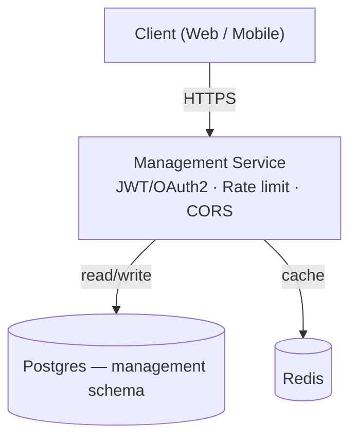

# Container Yard Management System

Hệ thống quản lý kho bãi container logistics: quản lý Warehouse, Container, Vehicle, Hợp đồng, Shipment, Gate-in/Gate-out, di chuyển nội bộ, đến Invoice/Payment.

## Kiến trúc

Backend là 1 service duy nhất (Management Service), 1 database Postgres:

- **Management Service** — CRUD nghiệp vụ: Warehouse, Contract, Shipment, Vehicle, Container, Yard Visit, Inspection, Movement, Event, Invoice, Payment.



> Ghi chú: bản thiết kế trước đây có tách riêng 1 "Yard Optimize Service" để tối ưu vị trí lưu bãi (Slot Allocation) qua Message Broker. Phần này đã được **gộp lại vào Management** ở mức đơn giản (chỉ lưu vị trí, không có thuật toán tối ưu) để phù hợp phạm vi đồ án — xem `docs/` để biết chi tiết đã lược bỏ những gì.

## Tech stack

- Backend: NestJS (1 service), Postgres (1 database, schema `management`)
- Xác thực: JWT, RBAC (role/permission lưu trong DB)
- Cache: Redis (cho danh mục/báo cáo truy vấn nhiều)
- Containerization: Docker / Docker Compose
- API docs: Swagger / OpenAPI

## Cấu trúc thư mục

```
.
├── app/
│   ├── backend/
│   │   └── Management/   # Management Service (NestJS + pg) — Auth/RBAC, Contract, Warehouse, Vehicle...
│   └── frontend/
│       └── Managemnet/   # chưa triển khai
├── db/init/               # script SQL tạo schema Postgres (management)
├── docs/                  # tài liệu nội bộ (SRS, ERD, HLD, API spec...), không push công khai
├── postman/               # collection/environment Postman để test API
├── tests/
├── docker-compose.yml
├── .env.example
└── README.md
```

## Chạy dự án

1. Tạo file cấu hình local (không commit):

   ```bash
   cp .env.example .env
   ```

2. Chạy hạ tầng (Postgres + Redis + Management Service):

   ```bash
   docker compose up -d --build
   ```

3. Schema (`management.*`) được tự tạo ngay từ lần đầu Postgres khởi động, qua các file SQL trong `db/init/` (không cần chạy migration thủ công). Lần chạy đầu tiên cần tạo tài khoản Admin — xem `BOOTSTRAP_ADMIN_EMAIL`/`BOOTSTRAP_ADMIN_PASSWORD` trong `.env`:

   ```bash
   docker compose exec management-service npm run db:seed
   ```

4. (Tuỳ chọn) Sinh sẵn dữ liệu demo/test — hàng ngàn dòng trải đều mọi bảng (Warehouse, Vehicle, Contract, Container, Shipment, Yard Visit, Inspection, Movement, Event, Invoice, Payment...) và 6 tài khoản theo từng role, để có dữ liệu thật ngay khi mở Swagger/Postman thay vì phải tạo tay:

   ```bash
   docker compose exec management-service npm run db:seed:fake
   ```

   Chạy lại nhiều lần sẽ cộng dồn thêm dữ liệu mới (không xoá dữ liệu cũ). Tài khoản demo dùng chung mật khẩu `Passw0rd1`:

   | Email | Role |
   |---|---|
   | `admin2@example.local` | ADMIN (full quyền) |
   | `dispatcher@example.local` | DISPATCHER |
   | `operator@example.local` | OPERATOR |
   | `inspector@example.local` | INSPECTOR |
   | `accountant@example.local` | ACCOUNTANT |
   | `viewer@example.local` | VIEWER |

### Các endpoint chính (Management Service — mặc định cổng `3001`, đổi qua `MANAGEMENT_SERVICE_PORT`)

3 endpoint dưới đây là điểm vào đặc biệt để **kiểm tra/test** service — không phải API nghiệp vụ như các route còn lại:

| Endpoint | Công dụng |
|---|---|
| [http://localhost:3001/health](http://localhost:3001/health) | Health check — service (và kết nối DB) đã sẵn sàng hay chưa; dùng cho Docker healthcheck/CI. |
| [http://localhost:3001/docs](http://localhost:3001/docs) | **Swagger UI** — giao diện xem và thử trực tiếp toàn bộ API (request/response mẫu, thử nhanh không cần Postman). Endpoint cần JWT thì bấm nút "Authorize" và dán access token lấy từ `POST /auth/login`. |
| [http://localhost:3001/docs-json](http://localhost:3001/docs-json) | **OpenAPI spec (JSON)** tự sinh từ code — dùng để import vào Postman (Import → Link), hoặc các công cụ sinh client/API doc khác. Luôn khớp 1-1 với API thật vì lấy trực tiếp từ decorator trong code, không cần đồng bộ tay. |

### Test tự động bằng Postman

[postman/ContainerYardManagement.postman_collection.json](postman/ContainerYardManagement.postman_collection.json) — import vào Postman rồi bấm **Run** (Collection Runner) để chạy tuần tự toàn bộ API hiện có (login → tạo permission/role/user/contract → activate/terminate → refresh/logout), tự lưu token và id giữa các bước, mỗi request có sẵn assertion pass/fail — không cần tự tay gọi và kiểm tra từng endpoint. Chạy ngoài Postman (CI/terminal) bằng [Newman](https://www.npmjs.com/package/newman):

```bash
npx newman run postman/ContainerYardManagement.postman_collection.json
```
