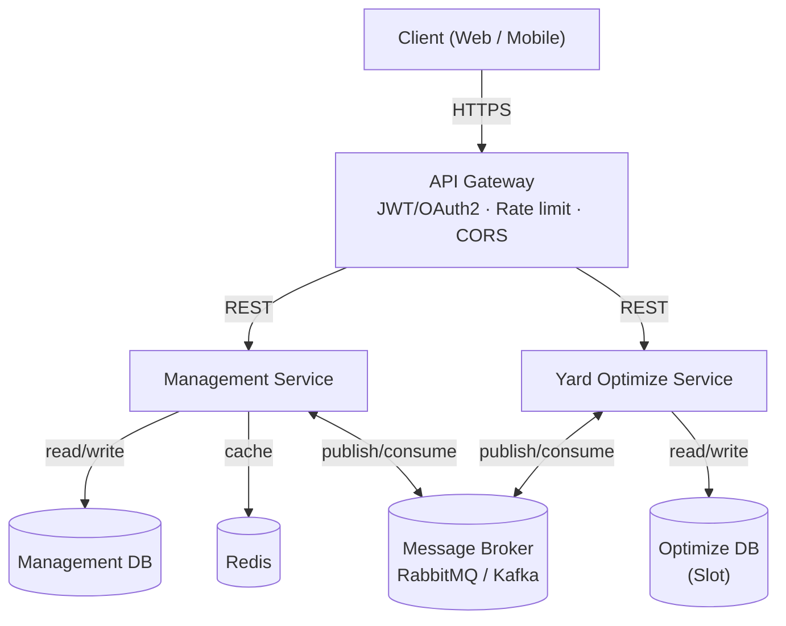

# Container Yard Management System

Hệ thống quản lý kho bãi container: quản lý vòng đời container từ Hợp đồng, Shipment, Gate-in, gán vị trí lưu bãi (Slot Allocation), di chuyển nội bộ, Gate-out, đến Invoice/Payment.

## Kiến trúc

Backend gồm 2 service tách biệt hoàn toàn dữ liệu, giao tiếp bất đồng bộ qua Message Broker:

- **Management Service** — CRUD nghiệp vụ: Contract, Shipment, Container, Yard Visit, Inspection, Movement, Event, Invoice, Payment.
- **Yard Optimize Service** — Slot Allocation & re-plan khi có Event; sở hữu dữ liệu Slot (sơ đồ bãi) và thuật toán tối ưu vị trí.



Chi tiết luồng event (publish/consume qua Broker):

| Chiều | Event |
|---|---|
| Management → Broker → Optimize | `ContainerReadyForAllocation`, `ReplanRequested`, `ContainerDeparted` |
| Optimize → Broker → Management | `SlotAllocated`, `RelocationProposed` |

## Tech stack

- Backend: 2 service độc lập (Management Service, Yard Optimize Service) — mỗi service 1 database riêng
- API Gateway: xác thực JWT/OAuth2, rate limit, CORS, định tuyến
- Message Broker: RabbitMQ / Kafka (giao tiếp bất đồng bộ giữa 2 service)
- Cache: Redis
- Containerization: Docker / Docker Compose
- CI/CD: tự động build, test, deploy khi có thay đổi code
- API docs: Swagger / OpenAPI

## Cấu trúc thư mục

```
.
├── management-service/
├── yard-optimize-service/
├── docker-compose.yml
└── README.md
```

## Chạy dự án

```bash
docker compose up --build
```

Lệnh mặc định chỉ chạy PostgreSQL và Management Service — đủ cho giai đoạn
CRUD hiện tại. Khi bắt đầu tích hợp cache, message broker và Slot Allocation,
chạy toàn bộ hạ tầng bằng:

```bash
docker compose --profile full up --build
```

- API Gateway: `http://localhost:<port>`
- Swagger docs: `http://localhost:<port>/docs`
- Health check: `GET /health`

## Tài liệu nội bộ

Các tài liệu chi tiết (SRS, ERD, Use Case Diagram, HLD đầy đủ...) là tài liệu nội bộ, **không push lên repository công khai** — lưu trữ riêng (Drive/Notion nội bộ nhóm). Thêm vào `.gitignore`:

```
docs/
internal-docs/
```
